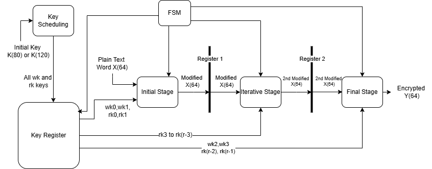

# Piccolo Cryptographic Algorithm VHDL Implementation

This VHDL project implements the Piccolo cryptographic algorithm, a lightweight block cipher designed for constrained environments. C code in file "checking_with_c" from repository [Daeinar/piccolo](https://github.com/Daeinar/piccolo.git) is used for testing and validating the VHDL implementation.

The project follows the specifications outlined in the paper [Piccolo: A Lightweight Block Cipher](https://www.iacr.org/archive/ches2011/69170343/69170343.pdf), aiming to provide efficient hardware-based encryption using the Piccolo algorithm.

## Top Level Design

For more information, visit the [Piccolo paper](https://www.iacr.org/archive/ches2011/69170343/69170343.pdf).