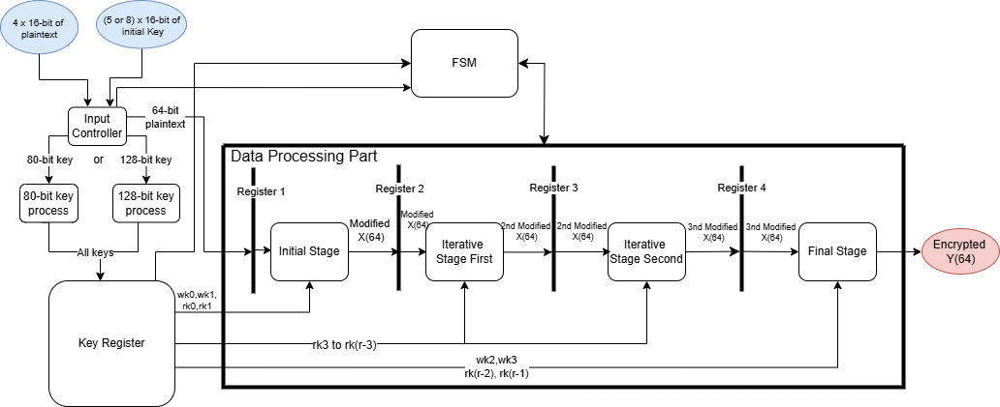
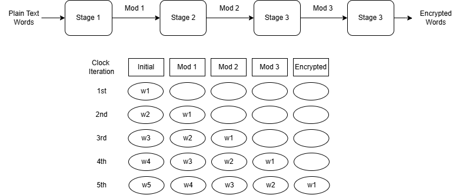

# Piccolo Cryptographic Algorithm VHDL Implementation

This VHDL project implements the Piccolo cryptographic algorithm, a lightweight block cipher designed for constrained environments. C code in file "checking_with_c" from repository [Daeinar/piccolo](https://github.com/Daeinar/piccolo.git) is used for testing and validating the VHDL implementation.

The project follows the specifications outlined in the paper [Piccolo: A Lightweight Block Cipher](https://www.iacr.org/archive/ches2011/69170343/69170343.pdf), aiming to provide efficient hardware-based encryption using the Piccolo algorithm.

## Top Level Design

The system performs encryption and decryption of a 64-bit input word into a 64-bit output word. It uses a key that is either 80 or 128 bits long, generating a set of subkeys for the entire process based on the key size. The main components of the circuit are the key production unit and the encryption/decryption unit for processing the input word.

Key generation is performed by the Key Schedule system, which adjusts based on the key size (80-bit or 128-bit). The key generation process produces 4 `wk` keys and either 50 or 62 `rk` keys depending on the initial key size. These keys are then loaded into a key register, which stores all the keys for the process. The key register has a fixed size of 33 slots of 32 bits, designed to handle the worst case of a 128-bit key.

## Pipeline in the Data Processing Part

In this section, the plaintext is input via register 1 and undergoes a series of processing stages. The data processing has been divided into 4 blocks, and a pipeline is applied to this structure. Initially, the iterative stage was a single large block, but it was split to reduce the overall latency as the plaintext and modified values pass through the stages.

The circuit takes the keys and plaintext as inputs and produces the encrypted output. The stages of the pipeline use the F and RP circuits combined with the keys to perform the encryption. The design is split into three units: the initial and final units (which use both `wk` and `rk` keys), and the internal unit (which only uses `rk` keys for intermediate calculations).

### Pipeline Details

Key generation happens once, and the keys are progressively fed into the circuit for processing. Registers are placed between stages to store intermediate values, and after the required cycles, the final output is produced. The circuit requires a total of 15 cycles for processing, which is the maximum time needed by any single stage. The latency and performance metrics are calculated as follows:

- **Latency (L)**:  
  The total number of cycles required to produce the output after the input is entered.  
  Formula:  
  `L = c(1) + c(2) + c(3) + c(4) + 4 * 1`  
  Breakdown:  
  `L = 1 + 15 + 14 + 1 + 4 = 35 cycles`

- **Time per Data**:  
  The time required to produce one output, given the clock frequency.  
  Formula:  
  `Time per Data = Tclock * L = 35 / fclock`

- **Throughput (θ)**:  
  The rate at which data is processed by the circuit.  
  Formula:  
  `Throughput = θ = 1 / L = 1 / 35`

- **Pipeline Throughput (Tresult)**:  
  The time required for the next result to be produced after the previous one, accounting for the maximum cycles in any given stage.  
  Formula:  
  `Pipeline Throughput = Tresult = Tclock * (max(cycles of stages) + 1)`  
  Breakdown:  
  `Tresult = (15 + 1) / fclock = 16 / fclock`

For more information, visit the [Piccolo paper](https://www.iacr.org/archive/ches2011/69170343/69170343.pdf).
